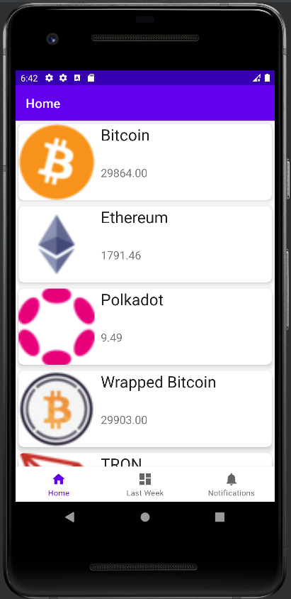

# Crypto Prices
## TP4 Laboratorio de Programacion 2021 | Universidad Nacional del Comahue

* Faustino Maggionin Duffy
* Lucas Tognozzi

### Introduccion

* Crypto Prices es una aplicacion de android nativa que muestra cierta informacion sobre
  las cryptomonedas. Esta informacion es conseguida a traves nuestra API:
  https://stormy-citadel-21324.herokuapp.com/api/coins, tambien hecha como un trabajo de esta materia.
  A su vez esta API consulta, filtra y devuelve los datos desde Coing Gecko.
  
* En la aplicacion tenemos 2 pantallas, la principal muestra los datos (precios) de las monedas al
  dia de la fecha, y la segunda los precios de hace 7 dias. 
  
### Librerias

* En Crypto Prices utilizamos las siguientes librerias:
    * Retrofit, para consultar al backend.
    * Moshi, para representar los datos obtenidos con Retrofit en formato JSON.  
    * Glide, para poder renderizar imagenes con facilidad en la app.
    * Firestore Cloud, como base de datos. Principalemente usada para almacenar datos localmente y 
    que puedan ser accedidos sin conexion a internet.
      
### Arquitectura

* Usamos una arquitectura simple, una clase que extiende de Fragment con RecyclerView para cada 
  pantalla. Cada una con su correspondiente Adapter que lee los datos provistos por ApiService, una
  clase que consulta la API utilizando Retrofit, los parsea y los muestra en pantalla segun es 
  necesario. Por cada consulta, guarda una copia de los datos en la base de datos de Firestore y 
  cuando detecta que el dispositivo no tiene conexion a internet, en vez de llamar a ApiService, 
  trae los datos directamente desde la copia local.

* #### Estructura:
├── AndroidManifest.xml
├── java
│   └── com
│       └── example
│           └── offline_crypto
│               ├── MainActivity.kt
│               ├── models
│               │   └── Property.kt
│               ├── network
│               │   └── ApiService.kt
│               ├── ui
│               │   ├── home
│               │   │   ├── CurrentAdapter.kt
│               │   │   ├── HomeFragment.kt
│               │   │   └── HomeViewModel.kt
│               │   ├── lastweek
│               │   │   ├── LastWeekAdapter.kt
│               │   │   ├── LastWeekFragment.kt
│               │   │   └── LastWeekViewModel.kt
│               │   └── notifications
│               │       ├── NotificationsFragment.kt
│               │       └── NotificationsViewModel.kt
│               └── Utils.kt
└── res
    ├── drawable
    │   ├── ic_check.xml
    │   ├── ic_dashboard_black_24dp.xml
    │   ├── ic_home_black_24dp.xml
    │   ├── ic_launcher_background.xml
    │   └── ic_notifications_black_24dp.xml
    ├── drawable-v24
    │   └── ic_launcher_foreground.xml
    ├── layout
    │   ├── activity_main.xml
    │   ├── fragment_home.xml
    │   ├── fragment_lastweek.xml
    │   ├── fragment_notifications.xml
    │   └── list_item.xml
    ├── menu
    │   └── bottom_nav_menu.xml
    ├── mipmap-anydpi-v26
    │   ├── ic_launcher_round.xml
    │   └── ic_launcher.xml
    ├── mipmap-hdpi
    │   ├── ic_launcher_round.webp
    │   └── ic_launcher.webp
    ├── mipmap-mdpi
    │   ├── ic_launcher_round.webp
    │   └── ic_launcher.webp
    ├── mipmap-xhdpi
    │   ├── ic_launcher_round.webp
    │   └── ic_launcher.webp
    ├── mipmap-xxhdpi
    │   ├── ic_launcher_round.webp
    │   └── ic_launcher.webp
    ├── mipmap-xxxhdpi
    │   ├── ic_launcher_round.webp
    │   └── ic_launcher.webp
    ├── navigation
    │   └── mobile_navigation.xml
    ├── values
    │   ├── colors.xml
    │   ├── dimens.xml
    │   ├── strings.xml
    │   └── themes.xml
    └── values-night
        └── themes.xml

  
### Ejemplos
* #### Pantalla de hoy:

* #### Pantalla de la semana pasada:

